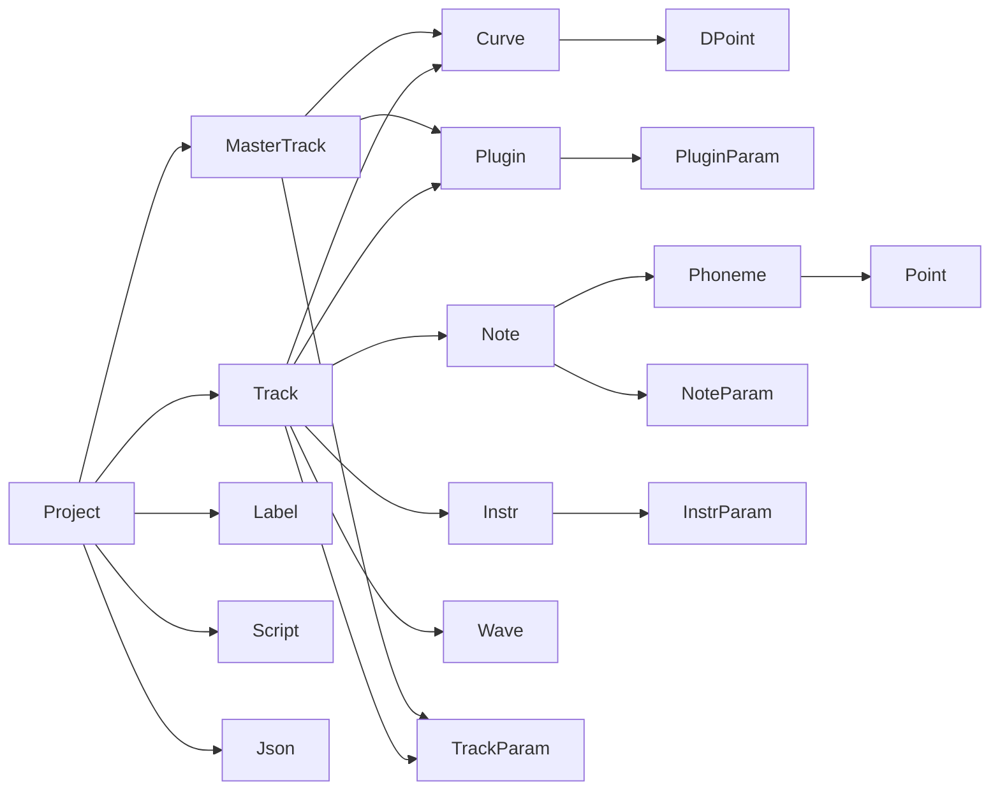

# 工程的树状结构

```mermaid
graph LR

A[Project]
B[Track]
C[MasterTrack]
D[Label]
E[Script]
F[Json]
G[Curve]
H[Plugin]
I[Note]
J[Instr]
K[Wave]
L[TrackParam]
M[DPoint]
N[PluginParam]
O[Phoneme]
P[NoteParam]
Q[InstrParam]
R[Point]

A-->B
A-->C
A-->D
A-->E
A-->F
B-->G
B-->H
B-->I
B-->J
B-->K
B-->L
C-->G
C-->H
C-->L
G-->M
H-->N
I-->O
I-->P
J-->Q
O-->R
```